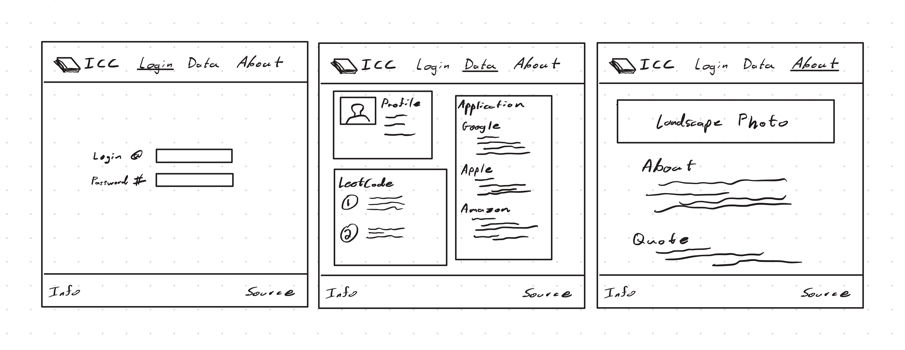
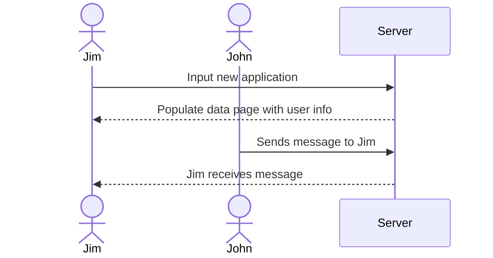

# Internship Command Center

[My Notes](notes.md)

Internship Command Center is a career-tracking platform designed for Computer Science students currently looking for internships and full-time employment. The application allows users to track current applications, interview progress, monitor LeetCode preparation, and maintain multiple resume versions throughout the recruiting process.

The platform connects relevant data to eachother. Users may connect notes, LeetCode probless, and specific resume versions with individual job or internship applications. Internship Command Center streamlines the application and interview process by centralizing recruting-related information in a single location.

> [!NOTE]
> This is a template for your startup application. You must modify this `README.md` file for each phase of your development. You only need to fill in the section for each deliverable when that deliverable is submitted in Canvas. Without completing the section for a deliverable, the TA will not know what to look for when grading your submission. Feel free to add additional information to each deliverable description, but make sure you at least have the list of rubric items and a description of what you did for each item.

> [!NOTE]
> If you are not familiar with Markdown then you should review the [documentation](https://docs.github.com/en/get-started/writing-on-github/getting-started-with-writing-and-formatting-on-github/basic-writing-and-formatting-syntax) before continuing.

### Elevator pitch

Computer Science students face an increasingly competitive internship and job market. Keeping track of applications, interview preparation, LeetCode practice, resumes, and company-specific notes can quickly become overwhelming.

Internship Command Center helps students stay organized throughout the entire recruiting process. Through a single, easy-to-use dashboard, users can manage applications, store interview notes, track resume versions, and monitor LeetCode progress. Problems can be categorized, marked for future review, and linked directly to interview preparation efforts.

Instead of digging through folders, spreadsheets, and scattered notes, students can keep everything related to their career search in one place. Internship Command Center helps aspiring software engineers spend less time organizing and more time preparing for success.

### Design

Here is a sequence diagram that shows how to people would interact with the backend to input job search data.

### Key features

- Secure login over HTTPS
- User summary dashboard persistently stored
- Add job application data
- Update status: saved, applied, OA, interview, affer, rejected
- Add interview notes
- Track LeetCode problem count by topic
- Upload or link resume version
- Live chat between application users

### Technologies

I am going to use the required technologies in the following ways.

- **HTML** - Uses correct HTML structure for application. Three HTML pages. One for login, one for dashboard, and one for application description.
- **CSS** - Application styling that looks good on different screen sizes, uses good whitespace, color choice and contrast.
- **React** - Provides login, data input, chat interface, display profile data, and use of REact for routing and components.
- **Service** - Backend service with endpoints for:
    - login
    - retrieving user data
    - inputing user data
    - retrieving chat history
- **DB/Login** - Store users, data, and chat history in database. REgister and login users. Credentials securely stored in database. Can't use program unless authenticated.
- **WebSocket** - As each user uses the program other authenticated users receive updated data via broadcast.

## 🚀 Specification Deliverable

> [!NOTE]
> Fill in this sections as the submission artifact for this deliverable. You can refer to this [example](https://github.com/webprogramming260/startup-example/blob/main/README.md) for inspiration.

For this deliverable I did the following. I checked the box `[x]` and added a description for things I completed.

- [x] I completed the prerequisites for this deliverable (Git commit requirement)
- [x] Proper use of Markdown
- [x] A concise and compelling elevator pitch
- [x] Description of key features
- [x] Description of how you will use each technology
- [x] One or more rough sketches of your application. Images must be embedded in this file using Markdown image references.

## 🚀 AWS deliverable

For this deliverable I did the following. I checked the box `[x]` and added a description for things I completed.

- [x] **Rented EC2 server**
- [x] **Leased domain name**
- [x] **Server accessible** from my domain: [https://benjaminanderson.me](https://benjaminanderson.me)

## 🚀 HTML deliverable

For this deliverable I did the following. I checked the box `[x]` and added a description for things I completed.

- [x] I completed the prerequisites for this deliverable (Simon deployed, GitHub link, Git commits)
- [x] **HTML pages** - I added html pages for each major program feature.
- [x] **Proper HTML element usage** - I included proper HTML elemnts: head, body, header, main, footer, etc...
- [x] **Links** - I added links to different parts of the website as required.
- [x] **Text** - Relevent and descriptive text is placed accross the site.
- [x] **3rd party API placeholder** - Two placeholders for API implementation are placed on profile.html.
- [x] **Images** - Images are incerted and linked to as placeholders accross the site.
- [x] **Login placeholder** - A login placeholder has been added to the site.
- [x] **DB data placeholder** - chat history and profile information placeholders are a reflection of data being pulled from the database.
- [x] **WebSocket placeholder** - The chat function of the site is to represent WebSocket capabilities.

## 🚀 CSS deliverable

For this deliverable I did the following. I checked the box `[x]` and added a description for things I completed.

- [x] I completed the prerequisites for this deliverable (Simon deployed, GitHub link, Git commits)
- [ ] **Visually appealing colors and layout. No overflowing elements.** - I did not complete this part of the deliverable.
- [ ] **Use of a CSS framework** - I did not complete this part of the deliverable.
- [ ] **All visual elements styled using CSS** - I did not complete this part of the deliverable.
- [ ] **Responsive to window resizing using flexbox and/or grid display** - I did not complete this part of the deliverable.
- [ ] **Use of a imported font** - I did not complete this part of the deliverable.
- [ ] **Use of different types of selectors including element, class, ID, and pseudo selectors** - I did not complete this part of the deliverable.

## 🚀 React part 1: Routing deliverable

For this deliverable I did the following. I checked the box `[x]` and added a description for things I completed.

- [ ] I completed the prerequisites for this deliverable (Simon deployed, GitHub link, Git commits)
- [ ] **Bundled using Vite** - I did not complete this part of the deliverable.
- [ ] **Components** - I did not complete this part of the deliverable.
- [ ] **Router** - I did not complete this part of the deliverable.

## 🚀 React part 2: Reactivity deliverable

For this deliverable I did the following. I checked the box `[x]` and added a description for things I completed.

- [ ] I completed the prerequisites for this deliverable (Simon deployed, GitHub link, Git commits)
- [ ] **All functionality implemented or mocked out** - I did not complete this part of the deliverable.
- [ ] **Hooks** - I did not complete this part of the deliverable.

## 🚀 Service deliverable

For this deliverable I did the following. I checked the box `[x]` and added a description for things I completed.

- [ ] I completed the prerequisites for this deliverable (Simon deployed, GitHub link, Git commits)
- [ ] **Node.js/Express HTTP service** - I did not complete this part of the deliverable.
- [ ] **Static middleware for frontend** - I did not complete this part of the deliverable.
- [ ] **Calls to third party endpoints** - I did not complete this part of the deliverable.
- [ ] **Backend service endpoints** - I did not complete this part of the deliverable.
- [ ] **Frontend calls service endpoints** - I did not complete this part of the deliverable.
- [ ] **Supports registration, login, logout, and restricted endpoint** - I did not complete this part of the deliverable.
- [ ] **Uses BCrypt to hash passwords** - I did not complete this part of the deliverable.

## 🚀 DB deliverable

For this deliverable I did the following. I checked the box `[x]` and added a description for things I completed.

- [ ] I completed the prerequisites for this deliverable (Simon deployed, GitHub link, Git commits)
- [ ] **Stores data in MongoDB** - I did not complete this part of the deliverable.
- [ ] **Stores credentials in MongoDB** - I did not complete this part of the deliverable.

## 🚀 WebSocket deliverable

For this deliverable I did the following. I checked the box `[x]` and added a description for things I completed.

- [ ] I completed the prerequisites for this deliverable (Simon deployed, GitHub link, Git commits)
- [ ] **Backend listens for WebSocket connection** - I did not complete this part of the deliverable.
- [ ] **Frontend makes WebSocket connection** - I did not complete this part of the deliverable.
- [ ] **Data sent over WebSocket connection** - I did not complete this part of the deliverable.
- [ ] **WebSocket data displayed** - I did not complete this part of the deliverable.
- [ ] **Application is fully functional** - I did not complete this part of the deliverable.
